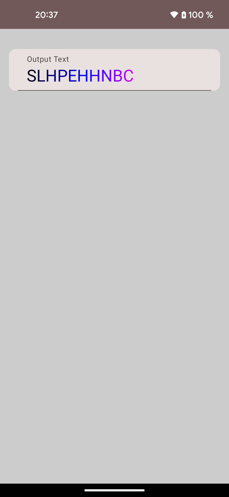
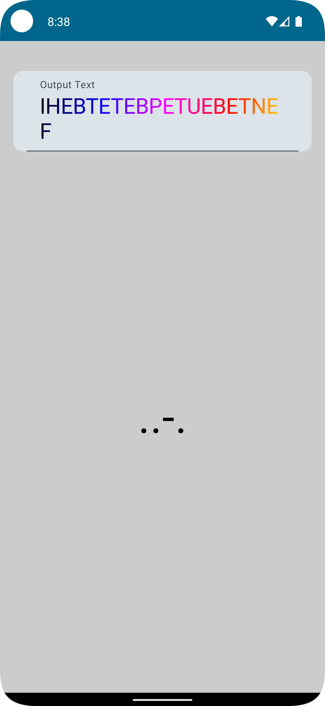

# MorseCodeCompose
Morse Code app using gestures written in Kotlin and Compose
### Features

- Using MVI design pattern
- UI: Screen, ViewModel, UiState, Intent
- Using gestures such as **Tap**(for the ".") and **LongPress** (for the "-") you can produce letters.
- Implemented DynamicColors to enable users to personalize their color experience in the app [developer.android reference](https://developer.android.com/develop/ui/views/theming/dynamic-colors)

 ## Screenshot examples

    
